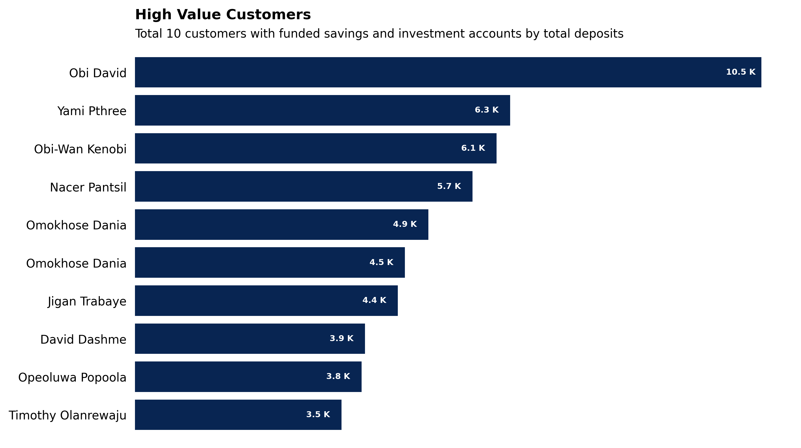

## Cowryrise Data Analyst Assessment

#### Q1 - High Value Customers with Multipe Products
In this question, the goal was to know customers who have at least one funded investment plan and one funded savings plans. To achieve this, I took the following steps:

* I made 2 CTEs `savings_users` and `investment_users` for both funded investment plans and funded savings plans. The data was then grouped and aggregated by count (e.g savings_count / investment_count) for each user. I used a CTE instead of a complex subquery because I believe it is more readable.

* The previously created CTEs were joined using an inner join with the users table `users_customuser` and  the transaction table `savings_savingsaccount` and finally grouped by the name which was a concatenation of the first and last name, the savings_count and investment_count and aggregated by count again to get the total deposits.

* Additionally I connected the database to python using the `pymysql` package to enable me plot the result of the query.

#### Q2 - Transaction Frequency Analysis
The goal in this question was to classify customers either as High, Medium or Low Frequency customers.
To answer this question, I took the following steps:

* I calculated the total number of transactions that each user has made for each month. This was achieved by concatenating the month name and the year and grouping by it and then aggregating by count. The result was stored in a CTE `monthly_transactions`.

* The average number of transactions for each month was computed by taking the average of the total transactions made each month. This was done by grouping the data from the above CTE by the user and aggregating by average. The result from here was also stored in a CTE.

* A case when statement was used to create the desired labels needed e.g (High Frequency, Low Frequency) to categorise the users. The data was then grouped by this category and agreated by count of user id to get the total number of customers that fall in each category and by the average of the monthly transactions to get the average number of monthly transactions user in each category perform.

* Python was used to connect to the database to enable data visualisation

#### Q3 - Account Inactivity Alert

The goal here is to identify accounts that have not made any transactions in the last 1 year.
Here is a breakdown of how I identified the inactive accounts.

* I grouped the data in the transaction table `savings_savingsaccount` by the plan_id and then aggregated by the maximum transaction date using the max function. This ensures that I get the last date that a transaction occured for each plan.

* The difference between the current date and the last transaction date was computed using the `DATEDIFF` fucntion before filtering for plans where the number of days since the last transaction is greater than 365.

* The data of inactive users is inner joined with the plans table `plans_plan`, this enables us to categorise the accounts of inactive_users into savings or investment accounts.

* The plot below shows the share of inactive accounts that are investments or savings.

#### Q4 - Customer Lifetime Value (CLV) Estimation

The goal here is to identify customer lifetime value of each customer. To do this, here are the steps I followed:

* I computed the profits that the company made from each customer in naira and stored the result in a CTE called profits.

* I ensured that the transactions considered are only transactions that have been marked as successful, so as to report accurately.

* The profits CTE is used to calculate the CLV with the fomular prescribed on the assessment. The customer table and the profits CTE were joined using an inner join.

* Python was used the visualise the 10 most valuable customers

#### Challeneges

There weren't particularyly any challenges. However, I noticed there are customers with exactly the same name but differemt customer id